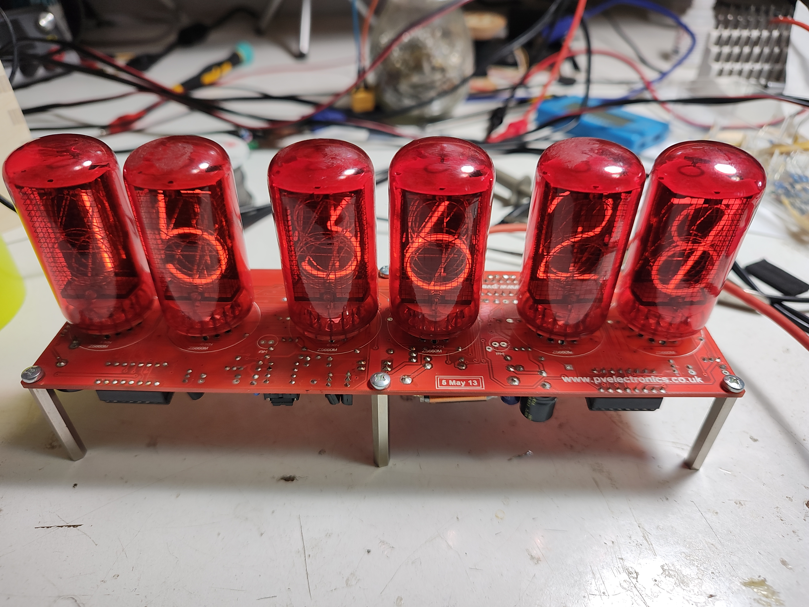
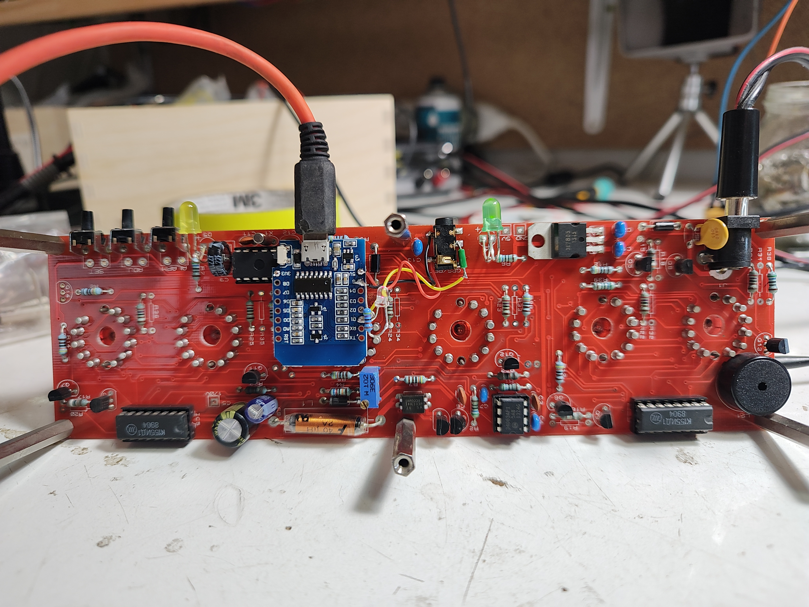

# GPS Time Emulator for Nixie Clock

This project provides an emulator for the Nixie clock, which originally uses GPS to get the current time. The emulator is designed to run on an ESP8266 microcontroller and connects to an NTP server to obtain accurate time information. As GPS is not practical where my Nixie clock is located, I have developed this emulator.

## Features

- Emulates the $GPRMC sentence with valid time information
- Connects to an NTP server to synchronize time
- Provides accurate time information for the Nixie clock

## Requirements

- ESP8266 microcontroller
- PlatformIO or compatible development environment
- Meant to be used with the [legacy kit from PV Electronics](https://web.archive.org/web/20140811001205/http://www.pvelectronics.co.uk/index.php?main_page=product_info&cPath=18&products_id=61)
- Should also work in different applications

## Installation

1. Clone or download the project repository.
2. Modify your SSID and Password or create your own ```credentials.h```
3. Compile in PlatformIO.
4. Upload the code to the ESP8266.

## Usage

1. Connect the Nixie clock to the ESP8266. Only 5V, GND, and D1 (software serial TX) are needed.
2. Power on the ESP8266.
3. The emulator will automatically connect to the NTP server and synchronize the time.
4. The Nixie clock will display the accurate time obtained from the emulator.

## Photo



## Contributing

Contributions are welcome! If you have any ideas, suggestions, or bug reports, please open an issue or submit a pull request.

## License

This project is licensed under the [MIT License](LICENSE).
